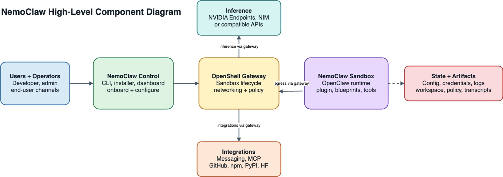

<!-- SPDX-FileCopyrightText: Copyright (c) 2026 NVIDIA CORPORATION & AFFILIATES. All rights reserved. -->
<!-- SPDX-License-Identifier: Apache-2.0 -->
# NemoClaw Architecture Overview

This page explains how NemoClaw runs OpenClaw inside an OpenShell sandbox and how the gateway connects the agent to inference, integrations, and policy.

NemoClaw does not replace OpenClaw or OpenShell.
It packages them into a repeatable setup with a host CLI, a versioned blueprint, default policies, inference setup, plugin configuration, and state helpers.
You can use that setup directly or adapt it for your own OpenShell integration.

## High-Level Flow

NemoClaw keeps the user workflow on the host while OpenShell enforces the sandbox boundary.
The gateway sits between NemoClaw control, the sandbox, inference providers, and external integrations.
That placement lets NemoClaw configure the environment without giving the agent direct access to host credentials or uncontrolled network egress.

The diagram has the following components:

| Component | Role in the flow |
|-------|------------------|
| Users and operators | Start from the CLI, installer, dashboard, or an end-user channel. |
| NemoClaw control | Collects configuration, runs onboarding, prepares the blueprint, and asks OpenShell to create or update resources. |
| OpenShell gateway | Owns sandbox lifecycle, networking, policy enforcement, inference routing, and integration egress. |
| NemoClaw sandbox | Runs OpenClaw with the NemoClaw plugin, the selected blueprint contents, and supporting tools. |
| Inference | Receives model requests through the gateway, using NVIDIA endpoints, NIM, or compatible APIs. |
| Integrations | Reach messaging services, MCP servers, GitHub, package indexes, or model hubs through gateway-managed egress. |
| State and artifacts | Store configuration, credentials, logs, workspace files, policies, and transcripts outside the running agent process. |

For repository layout, file paths, and deeper diagrams, see Architecture (use the `nemoclaw-user-reference` skill).

## Design Principles

NemoClaw architecture follows the following principles.

Thin plugin, versioned blueprint
: The sandbox plugin stays small and stable. Host-side orchestration uses a versioned blueprint and runner that can evolve on its own release cadence.

Respect CLI boundaries
: The `nemoclaw` CLI is the primary interface for sandbox management.

Supply chain safety
: Blueprint artifacts are immutable, versioned, and digest-verified before execution.

OpenShell-backed lifecycle
: NemoClaw orchestrates OpenShell resources under the hood, but `nemoclaw onboard`
  is the supported operator entry point for creating or recreating NemoClaw-managed sandboxes.

Reproducible setup
: Running setup again recreates the sandbox from the same blueprint and policy definitions.

## CLI, Plugin, and Blueprint

NemoClaw is split into three integration pieces:

- The _host CLI_ runs onboarding, validates provider choices, stores configuration, and calls OpenShell commands for gateway, provider, sandbox, and policy operations.
- The _plugin_ is a TypeScript package that runs with OpenClaw inside the sandbox.
  It registers the managed inference provider metadata, the `/nemoclaw` slash command, and runtime context hooks.
- The _blueprint_ is a versioned YAML package with the sandbox image, policy, inference profile, and supporting assets.
  The runner resolves and verifies the blueprint before applying it through OpenShell.

This separation keeps the sandbox plugin small while allowing host orchestration and blueprint contents to evolve on their own release cadence.

## Sandbox Creation

When you run `nemoclaw onboard`, NemoClaw creates an OpenShell sandbox that runs OpenClaw in an isolated container.
The host CLI and blueprint runner orchestrate this process through the OpenShell CLI:

1. NemoClaw resolves the blueprint, checks version compatibility, and verifies the digest.
2. The onboarding flow determines which OpenShell resources to create or update, such as the gateway, inference providers, sandbox, and network policy.
3. The runner calls OpenShell CLI commands to create the sandbox and configure each resource.

After the sandbox starts, the agent runs inside it with all network, filesystem, and inference controls in place.

## Inference Routing

Inference requests from the agent never leave the sandbox directly.
OpenShell intercepts every inference call and routes it to the configured provider.
During onboarding, NemoClaw validates the selected provider and model, configures the OpenShell route, and bakes the matching model reference into the sandbox image.
The sandbox then talks to `inference.local`, while the host owns the actual provider credential and upstream endpoint.
If you select the Model Router provider, `inference.local` routes to a host-side router that chooses from the configured NVIDIA model pool for each request.

## Protection Layers

The sandbox starts with a default policy that controls network egress, filesystem access, process privileges, and inference routing.

| Layer | What it protects | When it applies |
|---|---|---|
| Network | Blocks unauthorized outbound connections. | Hot-reloadable at runtime. |
| Filesystem | Restricts system paths to read-only; `/sandbox` and `/tmp` are writable. | Locked at sandbox creation. |
| Process | Blocks privilege escalation and dangerous syscalls. | Locked at sandbox creation. |
| Inference | Reroutes model API calls to controlled backends. | Hot-reloadable at runtime. |

When the agent tries to reach an unlisted host, OpenShell blocks the request and surfaces it in the TUI for operator approval. Approved endpoints persist for the current session but are not saved to the baseline policy file.

For details on the baseline rules, refer to Network Policies (use the `nemoclaw-user-reference` skill). For container-level hardening, refer to Sandbox Hardening (use the `nemoclaw-user-deploy-remote` skill).

## Next Steps

- Read [Ecosystem](ecosystem.md) for stack-level relationships and NemoClaw versus OpenShell-only paths.
- Follow the Quickstart (use the `nemoclaw-user-get-started` skill) to launch your first sandbox.
- Refer to the Architecture (use the `nemoclaw-user-reference` skill) for the full technical structure, including file layouts and the blueprint lifecycle.
- Refer to Inference Options (use the `nemoclaw-user-configure-inference` skill) for detailed provider configuration.
