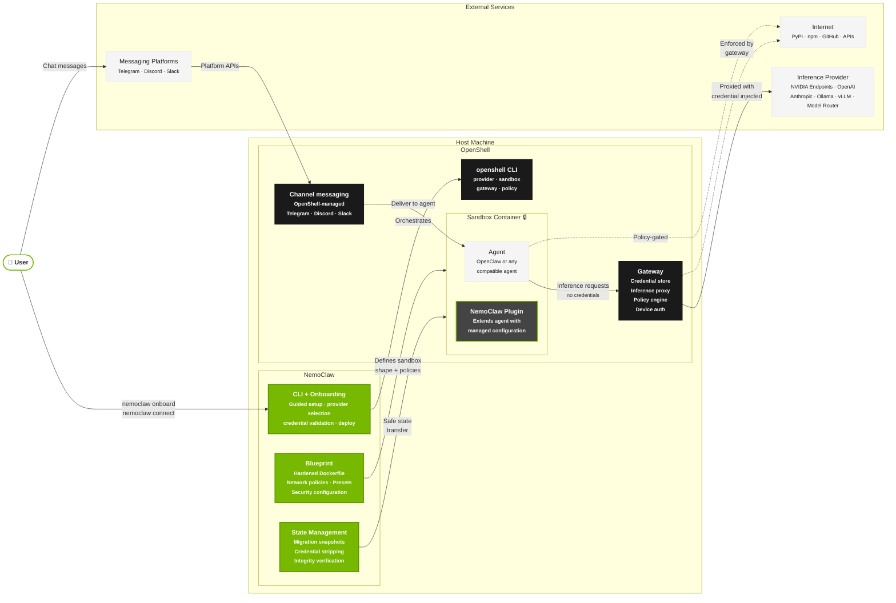
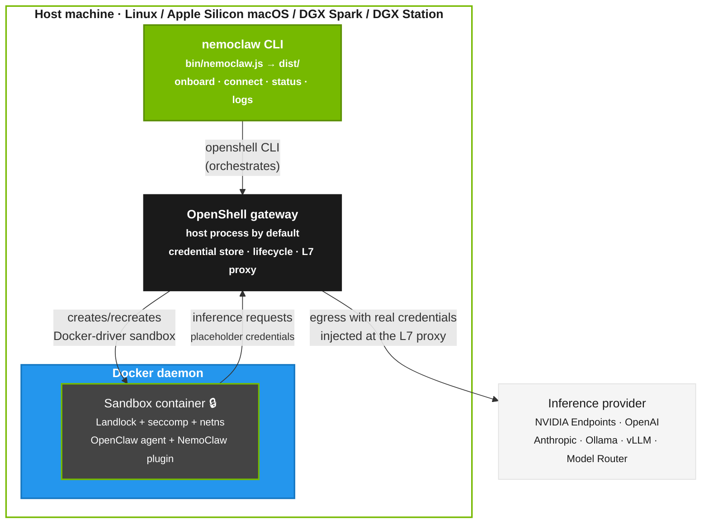
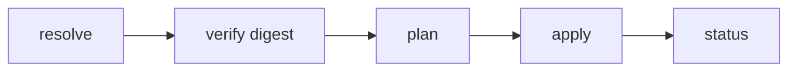

<!-- SPDX-FileCopyrightText: Copyright (c) 2026 NVIDIA CORPORATION & AFFILIATES. All rights reserved. -->
<!-- SPDX-License-Identifier: Apache-2.0 -->
# Architecture Details

NemoClaw combines a host CLI, a TypeScript plugin that runs with OpenClaw inside the sandbox, and a versioned YAML blueprint that defines the sandbox image, policies, and inference profiles applied through OpenShell.

## System Overview

NVIDIA OpenShell is a general-purpose agent runtime. It provides sandbox containers, a credential-storing gateway, inference proxying, and policy enforcement, but has no opinions about what runs inside. NemoClaw is an opinionated reference stack built on OpenShell that handles what goes in the sandbox and makes the setup accessible.



## Deployment Topology

The logical diagram above shows how components relate.
This section shows what actually runs where on the host.
NemoClaw's default Docker-driver topology does not place the sandbox in an embedded k3s cluster.
On Linux and Apple Silicon macOS, NemoClaw starts the OpenShell Docker-driver gateway and creates the sandbox as a Docker container.
The gateway normally runs as a host process; Linux hosts that need the gateway compatibility patch may run the same gateway binary inside a small container.
In both Docker-driver modes, the sandbox is a Docker container, not a Kubernetes pod.
Legacy non-Docker-driver installs still use the k3s-based gateway path; the diagram below shows the standard Docker-driver topology.



Layering from top to bottom:

| Layer | Runs as | Role |
|---|---|---|
| Host CLI | Host process (`nemoclaw` on Node.js) | Orchestrates OpenShell via `openshell` CLI calls. |
| OpenShell gateway | Host process by default; optional Linux compatibility container when the gateway binary needs a newer host ABI | Hosts the credential store, owns sandbox lifecycle coordination, and provides the L7 proxy. |
| Docker daemon | Host service | Runs the Docker-driver sandbox container and, on affected Linux hosts, the optional gateway compatibility container. |
| Sandbox container | Docker container | Runs the OpenClaw agent and the NemoClaw plugin under Landlock + seccomp + netns. |
| OpenShell L7 proxy | Gateway process | Intercepts agent egress and rewrites `Authorization` headers (Bearer/Bot) and URL-path segments to inject the real credential at the network boundary. |

NemoClaw never gives the sandbox a raw provider key.
At onboard time it registers credentials with OpenShell's provider/placeholder system, and the L7 proxy substitutes the real value into outbound requests at egress.
The CLI helper `isInferenceRouteReady` (in `src/lib/onboard.ts`) is a host-side readiness check used by the resume flow to decide whether the active route already covers the chosen provider and model — it is not a runtime component.

For the DGX Spark-specific variant of this topology (cgroup v2, aarch64, unified memory), refer to the [NVIDIA Spark playbook](https://build.nvidia.com/spark/nemoclaw).

## NemoClaw Plugin

The plugin is a thin TypeScript package that registers an inference provider and the `/nemoclaw` slash command.
It runs in-process with the OpenClaw gateway inside the sandbox.
It also registers runtime hooks that keep the agent aware of its environment.
Before an agent turn starts, the plugin prepends a short context block with the active sandbox name, sandbox phase, network policy summary, and filesystem policy summary.
When the policy or phase changes during a session, the plugin sends a smaller update block instead of repeating the full context.

```text
nemoclaw/
├── src/
│   ├── index.ts                    Plugin entry: registers all commands
│   ├── cli.ts                      Commander.js subcommand wiring
│   ├── runtime-context.ts          Sandbox and policy context injection
│   ├── commands/
│   │   ├── launch.ts               Fresh install into OpenShell
│   │   ├── connect.ts              Interactive shell into sandbox
│   │   ├── status.ts               Blueprint run state + sandbox health
│   │   ├── logs.ts                 Stream blueprint and sandbox logs
│   │   └── slash.ts                /nemoclaw chat command handler
│   └── blueprint/
│       ├── resolve.ts              Version resolution, cache management
│       ├── fetch.ts                Download blueprint from OCI registry
│       ├── verify.ts               Digest verification, compatibility checks
│       ├── exec.ts                 Subprocess execution of blueprint runner
│       └── state.ts                Persistent state (run IDs)
├── openclaw.plugin.json            Plugin manifest
└── package.json                    Commands declared under openclaw.extensions
```

## NemoClaw Blueprint

The blueprint is a versioned YAML package with its own release stream.
The runner resolves, verifies, and applies the blueprint through the OpenShell CLI.
The blueprint defines the sandbox shape, default policies, and inference profiles; the runner performs the OpenShell operations.

```text
nemoclaw-blueprint/
├── blueprint.yaml                  Manifest: version, profiles, compatibility
├── model-specific-setup/           Agent-scoped model/provider compatibility manifests
├── router/                         Model Router config and routing engine
├── policies/
│   └── openclaw-sandbox.yaml       Default network + filesystem policy
```

The blueprint runtime (TypeScript) lives in the plugin source tree:

```text
nemoclaw/src/blueprint/
├── runner.ts                       CLI runner: plan / apply / status / rollback
├── ssrf.ts                         SSRF endpoint validation (IP + DNS checks)
├── snapshot.ts                     Migration snapshot / restore lifecycle
├── state.ts                        Persistent run state management
```

### Blueprint Lifecycle



1. Resolve. The plugin locates the blueprint artifact and checks the version against `min_openshell_version` and `min_openclaw_version` constraints in `blueprint.yaml`.
2. Verify. The plugin checks the artifact digest against the expected value.
3. Plan. The runner determines what OpenShell resources to create or update, such as the gateway, providers, sandbox, inference route, and policy.
4. Apply. The runner executes the plan by calling `openshell` CLI commands.
5. Status. The runner reports current state.

## Sandbox Environment

Normal NemoClaw onboarding builds from the
[`ghcr.io/nvidia/nemoclaw/sandbox-base`](https://github.com/NVIDIA/NemoClaw/pkgs/container/nemoclaw%2Fsandbox-base)
base image and layers the NemoClaw runtime Dockerfile on top. The direct blueprint
runner still carries a pinned OpenShell Community OpenClaw image for legacy
`openshell sandbox create --from` compatibility. Inside the sandbox:

- OpenClaw runs with the NemoClaw plugin pre-installed.
- Inference calls are routed through OpenShell to the configured provider.
- Network egress is restricted by the baseline policy in `openclaw-sandbox.yaml`.
- Filesystem access is confined to `/sandbox` and `/tmp` for read-write access, with system paths read-only.
- The NemoClaw plugin injects sandbox and policy context into agent turns so the agent can report policy blocks accurately.
- The image exposes a Docker health check that probes the in-sandbox gateway, so container runtimes can report whether the agent service is responding.
- The image includes common runtime compatibility helpers such as Homebrew and a `python` to `python3` symlink for tools that still invoke `python`.

## Inference Routing

Inference requests from the agent never leave the sandbox directly.
OpenShell intercepts them and routes to the configured provider:

```text
Agent (sandbox)  ──▶  OpenShell gateway  ──▶  NVIDIA Endpoint (build.nvidia.com)
```

When you select the Model Router provider, the OpenShell gateway routes to a host-side router process instead of a single upstream model.
The router selects from the configured pool, then calls the upstream NVIDIA endpoint with the credential held outside the sandbox.

Some model and provider combinations need agent-specific compatibility setup.
NemoClaw keeps those declarations under `nemoclaw-blueprint/model-specific-setup/<agent>/` so OpenClaw and Hermes fixes can be tested and reviewed independently.

Refer to Inference Options (use the `nemoclaw-user-configure-inference` skill) for provider configuration details.

## Provider Credential Storage

Provider credentials live in the OpenShell gateway store, not on the host filesystem.
NemoClaw never writes them to host disk; the OpenShell L7 proxy injects values at egress.
See Credential Storage (use the `nemoclaw-user-configure-security` skill) for the inspection, rotation, and migration flow.

## Host-Side State and Config

NemoClaw keeps non-secret operator-facing state on the host rather than inside the sandbox.

| Path | Purpose |
|---|---|
| `~/.nemoclaw/sandboxes.json` | Registered sandbox metadata, including the default sandbox selection. |
| `~/.openclaw/openclaw.json` | Host OpenClaw configuration that NemoClaw snapshots or restores during migration flows. |

The following environment variables configure optional services and local access.

| Variable | Purpose |
|---|---|
| `TELEGRAM_BOT_TOKEN` | Telegram bot token you provide before `nemoclaw onboard`. OpenShell stores it in a provider; the sandbox receives placeholders, not the raw secret. |
| `TELEGRAM_ALLOWED_IDS` | Comma-separated Telegram user or chat IDs for allowlists when onboarding applies channel restrictions. |
| `SLACK_BOT_TOKEN` | Slack bot token (`xoxb-...`) you provide before `nemoclaw onboard`. Stored as an OpenShell provider; never passed directly to the sandbox. |
| `SLACK_APP_TOKEN` | Slack app-level token (`xapp-...`) required for Socket Mode. Stored alongside `SLACK_BOT_TOKEN` during onboarding. |
| `SLACK_ALLOWED_USERS` | Comma-separated Slack member IDs for DM and channel `@mention` user allowlisting. |
| `SLACK_ALLOWED_CHANNELS` | Comma-separated Slack channel IDs where channel `@mention` events are enabled (e.g. `C012AB3CD,C987ZY6XW`). Baked into the sandbox image at build time. Combine with `SLACK_ALLOWED_USERS` to restrict both channel and member. |
| `CHAT_UI_URL` | URL for the optional chat UI endpoint. |
| `NEMOCLAW_DISABLE_DEVICE_AUTH` | Build-time-only toggle that disables gateway device pairing when set to `1` before the sandbox image is created. |

For normal setup and reconfiguration, prefer `nemoclaw onboard` over editing these files by hand.
Do not treat `NEMOCLAW_DISABLE_DEVICE_AUTH` as a runtime setting for an already-created sandbox.
