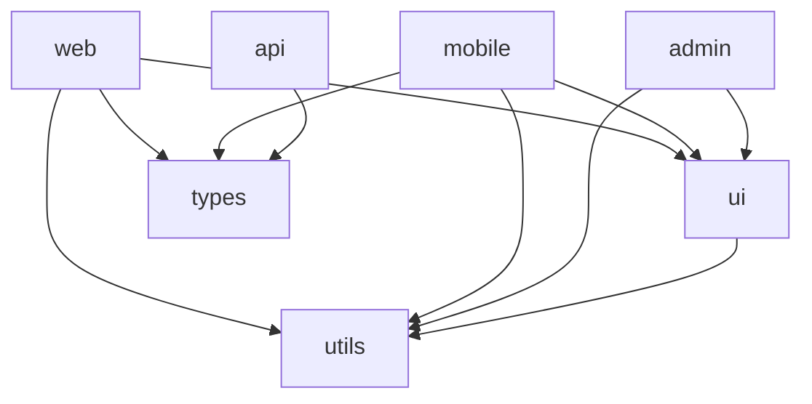

# monorepo-navigator reference

## Turborepo

### turbo.json pipeline config

```json
{
  "$schema": "https://turbo.build/schema.json",
  "globalEnv": ["NODE_ENV", "DATABASE_URL"],
  "pipeline": {
    "build": {
      "dependsOn": ["^build"],    // build deps first (topological order)
      "outputs": [".next/**", "dist/**", "build/**"],
      "env": ["NEXT_PUBLIC_API_URL"]
    },
    "test": {
      "dependsOn": ["^build"],    // need built deps to test
      "outputs": ["coverage/**"],
      "cache": true
    },
    "lint": {
      "outputs": [],
      "cache": true
    },
    "dev": {
      "cache": false,             // never cache dev servers
      "persistent": true          // long-running process
    },
    "type-check": {
      "dependsOn": ["^build"],
      "outputs": []
    }
  }
}
```

### Key commands

```bash
# Build everything (respects dependency order)
turbo run build

# Build only affected packages (requires --filter)
turbo run build --filter=...[HEAD^1]   # changed since last commit
turbo run build --filter=...[main]     # changed vs main branch

# Test only affected
turbo run test --filter=...[HEAD^1]

# Run for a specific app and all its dependencies
turbo run build --filter=@myorg/web...

# Run for a specific package only (no dependencies)
turbo run build --filter=@myorg/ui

# Dry-run — see what would run without executing
turbo run build --dry-run

# Enable remote caching (Vercel Remote Cache)
turbo login
turbo link
```

### Remote caching setup

```bash
# .turbo/config.json (auto-created by turbo link)
{
  "teamid": "team_xxxx",
  "apiurl": "https://vercel.com"
}

# Self-hosted cache server (open-source alternative)
# Run ducktape/turborepo-remote-cache or Turborepo's official server
TURBO_API=http://your-cache-server.internal \
TURBO_TOKEN=your-token \
TURBO_TEAM=your-team \
turbo run build
```

---

## Nx

### Project graph and affected commands

```bash
# Install
npx create-nx-workspace@latest my-monorepo

# Visualize the project graph (opens browser)
nx graph

# Show affected packages for the current branch
nx affected:graph

# Run only affected tests
nx affected --target=test

# Run only affected builds
nx affected --target=build

# Run affected with base/head (for CI)
nx affected --target=test --base=main --head=HEAD
```

### nx.json configuration

```json
{
  "$schema": "./node_modules/nx/schemas/nx-schema.json",
  "targetDefaults": {
    "build": {
      "dependsOn": ["^build"],
      "cache": true
    },
    "test": {
      "cache": true,
      "inputs": ["default", "^production"]
    }
  },
  "namedInputs": {
    "default":    ["{projectRoot}/**/*", "sharedGlobals"],
    "production": ["default", "!{projectRoot}/**/*.spec.ts", "!{projectRoot}/jest.config.*"],
    "sharedGlobals": []
  },
  "parallel": 4,
  "cacheDirectory": "/tmp/nx-cache"
}
```

---

## pnpm Workspaces

### pnpm-workspace.yaml

```yaml
packages:
  - 'apps/*'
  - 'packages/*'
  - 'tools/*'
```

### workspace:* protocol for local packages

```json
// apps/web/package.json
{
  "name": "@myorg/web",
  "dependencies": {
    "@myorg/ui":     "workspace:*",   // always use local version
    "@myorg/utils":  "workspace:^",   // local, but respect semver on publish
    "@myorg/types":  "workspace:~"
  }
}
```

### Useful pnpm workspace commands

```bash
# Install all packages across workspace
pnpm install

# Run script in a specific package
pnpm --filter @myorg/web dev

# Run script in all packages
pnpm --filter "*" build

# Run script in a package and all its dependencies
pnpm --filter @myorg/web... build

# Add a dependency to a specific package
pnpm --filter @myorg/web add react

# Add a shared dev dependency to root
pnpm add -D typescript -w

# List workspace packages
pnpm ls --depth -1 -r
```

---

## Cross-Package Impact Analysis

When a shared package changes, determine what's affected before you ship.

```bash
# Using Turborepo — show affected packages
turbo run build --filter=...[HEAD^1] --dry-run 2>&1 | grep "Tasks to run"

# Using Nx
nx affected:apps --base=main --head=HEAD    # which apps are affected
nx affected:libs --base=main --head=HEAD    # which libs are affected

# Manual analysis with pnpm
# Find all packages that depend on @myorg/utils:
grep -r '"@myorg/utils"' packages/*/package.json apps/*/package.json

# Using jq for structured output
for pkg in packages/*/package.json apps/*/package.json; do
  name=$(jq -r '.name' "$pkg")
  if jq -e '.dependencies["@myorg/utils"] // .devDependencies["@myorg/utils"]' "$pkg" > /dev/null 2>&1; then
    echo "$name depends on @myorg/utils"
  fi
done
```

---

## Dependency Graph Visualization

Generate a Mermaid diagram from your workspace:

```bash
# Generate dependency graph as Mermaid
cat > scripts/gen-dep-graph.js << 'EOF'
const { execSync } = require('child_process');
const fs = require('fs');

// Parse pnpm workspace packages
const packages = JSON.parse(
  execSync('pnpm ls --depth -1 -r --json').toString()
);

let mermaid = 'graph TD\n';
packages.forEach(pkg => {
  const deps = Object.keys(pkg.dependencies || {})
    .filter(d => d.startsWith('@myorg/'));
  deps.forEach(dep => {
    const from = pkg.name.replace('@myorg/', '');
    const to = dep.replace('@myorg/', '');
    mermaid += `  ${from} --> ${to}\n`;
  });
});

fs.writeFileSync('docs/dep-graph.md', '```mermaid\n' + mermaid + '```\n');
console.log('Written to docs/dep-graph.md');
EOF
node scripts/gen-dep-graph.js
```

**Example output:**



---

## Claude Code Configuration (Workspace-Aware CLAUDE.md)

Place a root CLAUDE.md + per-package CLAUDE.md files:

```markdown
# /CLAUDE.md — Root (applies to all packages)

## Monorepo Structure
- apps/web       — Next.js customer-facing app
- apps/admin     — Next.js internal admin
- apps/api       — Express REST API
- packages/ui    — Shared React component library
- packages/utils — Shared utilities (pure functions only)
- packages/types — Shared TypeScript types (no runtime code)

## Build System
- pnpm workspaces + Turborepo
- Always use `pnpm --filter <package>` to scope commands
- Never run `npm install` or `yarn` — pnpm only
- Run `turbo run build --filter=...[HEAD^1]` before committing

## Task Scoping Rules
- When modifying packages/ui: also run tests for apps/web and apps/admin (they depend on it)
- When modifying packages/types: run type-check across ALL packages
- When modifying apps/api: only need to test apps/api

## Package Manager
pnpm — version pinned in packageManager field of root package.json
```

```markdown
# /packages/ui/CLAUDE.md — Package-specific

## This Package
Shared React component library. Zero business logic. Pure UI only.

## Rules
- All components must be exported from src/index.ts
- No direct API calls in components — accept data via props
- Every component needs a Storybook story in src/stories/
- Use Tailwind for styling — no CSS modules or styled-components

## Testing
- Component tests: `pnpm --filter @myorg/ui test`
- Visual regression: `pnpm --filter @myorg/ui test:storybook`

## Publishing
- Version bumps via changesets only — never edit package.json version manually
- Run `pnpm changeset` from repo root after changes
```

---

## Migration: Multi-Repo → Monorepo

```bash
# Step 1: Create monorepo scaffold
mkdir my-monorepo && cd my-monorepo
pnpm init
echo "packages:\n  - 'apps/*'\n  - 'packages/*'" > pnpm-workspace.yaml

# Step 2: Move repos with git history preserved
mkdir -p apps packages

# For each existing repo:
git clone https://github.com/myorg/web-app
cd web-app
git filter-repo --to-subdirectory-filter apps/web  # rewrites history into subdir
cd ..
git remote add web-app ./web-app
git fetch web-app --tags
git merge web-app/main --allow-unrelated-histories

# Step 3: Update package names to scoped
# In each package.json, change "name": "web" to "name": "@myorg/web"

# Step 4: Replace cross-repo npm deps with workspace:*
# apps/web/package.json: "@myorg/ui": "1.2.3" → "@myorg/ui": "workspace:*"

# Step 5: Add shared configs to root
cp apps/web/.eslintrc.js .eslintrc.base.js
# Update each package's config to extend root:
# { "extends": ["../../.eslintrc.base.js"] }

# Step 6: Add Turborepo
pnpm add -D turbo -w
# Create turbo.json (see above)

# Step 7: Unified CI (see CI section below)
# Step 8: Test everything
turbo run build test lint
```

---

## CI Patterns

### GitHub Actions — Affected Only

```yaml
# .github/workflows/ci.yml
name: "ci"

on:
  push:
    branches: [main]
  pull_request:

jobs:
  affected:
    runs-on: ubuntu-latest
    steps:
      - uses: actions/checkout@v4
        with:
          fetch-depth: 0          # full history needed for affected detection

      - uses: pnpm/action-setup@v3
        with:
          version: 9

      - uses: actions/setup-node@v4
        with:
          node-version: 20
          cache: pnpm

      - run: pnpm install --frozen-lockfile

      # Turborepo remote cache
      - uses: actions/cache@v4
        with:
          path: .turbo
          key: ${{ runner.os }}-turbo-${{ github.sha }}
          restore-keys: ${{ runner.os }}-turbo-

      # Only test/build affected packages
      - name: "build-affected"
        run: turbo run build --filter=...[origin/main]
        env:
          TURBO_TOKEN: ${{ secrets.TURBO_TOKEN }}
          TURBO_TEAM: ${{ vars.TURBO_TEAM }}

      - name: "test-affected"
        run: turbo run test --filter=...[origin/main]

      - name: "lint-affected"
        run: turbo run lint --filter=...[origin/main]
```

### GitLab CI — Parallel Stages

```yaml
# .gitlab-ci.yml
stages: [install, build, test, publish]

variables:
  PNPM_CACHE_FOLDER: .pnpm-store

cache:
  key: pnpm-$CI_COMMIT_REF_SLUG
  paths: [.pnpm-store/, .turbo/]

install:
  stage: install
  script:
    - pnpm install --frozen-lockfile
  artifacts:
    paths: [node_modules/, packages/*/node_modules/, apps/*/node_modules/]
    expire_in: 1h

build:affected:
  stage: build
  needs: [install]
  script:
    - turbo run build --filter=...[origin/main]
  artifacts:
    paths: [apps/*/dist/, apps/*/.next/, packages/*/dist/]

test:affected:
  stage: test
  needs: [build:affected]
  script:
    - turbo run test --filter=...[origin/main]
  coverage: '/Statements\s*:\s*(\d+\.?\d*)%/'
  artifacts:
    reports:
      coverage_report:
        coverage_format: cobertura
        path: "**/coverage/cobertura-coverage.xml"
```

---

## Publishing with Changesets

```bash
# Install changesets
pnpm add -D @changesets/cli -w
pnpm changeset init

# After making changes, create a changeset
pnpm changeset
# Interactive: select packages, choose semver bump, write changelog entry

# In CI — version packages + update changelogs
pnpm changeset version

# Publish all changed packages
pnpm changeset publish

# Pre-release channel (for alpha/beta)
pnpm changeset pre enter beta
pnpm changeset
pnpm changeset version   # produces 1.2.0-beta.0
pnpm changeset publish --tag beta
pnpm changeset pre exit  # back to stable releases
```

### Automated publish workflow (GitHub Actions)

```yaml
# .github/workflows/release.yml
name: "release"

on:
  push:
    branches: [main]

jobs:
  release:
    runs-on: ubuntu-latest
    steps:
      - uses: actions/checkout@v4
      - uses: pnpm/action-setup@v3
      - uses: actions/setup-node@v4
        with:
          node-version: 20
          registry-url: https://registry.npmjs.org

      - run: pnpm install --frozen-lockfile

      - name: "create-release-pr-or-publish"
        uses: changesets/action@v1
        with:
          publish: pnpm changeset publish
          version: pnpm changeset version
          commit: "chore: release packages"
          title: "chore: release packages"
        env:
          GITHUB_TOKEN: ${{ secrets.GITHUB_TOKEN }}
          NODE_AUTH_TOKEN: ${{ secrets.NPM_TOKEN }}
```

---
