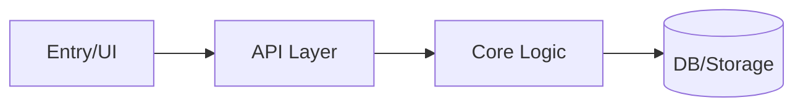

# VCO Overlay — GitNexus 架构地图（Clusters / Processes）

## Overlay Contract（advice-only）

- 本 overlay 只改变“架构对齐与文档化”的产出格式，不改变 VCO 的路由、协议与工具选择。
- 目标是用 GitNexus 的 cluster/process 视角快速建立共同语境，避免“各说各话”的模块边界争议。
- 若 GitNexus 不可用：用目录结构 + 关键入口点 + README/ADR + `rg` 的引用关系做简化地图。

## 你在团队里扮演的角色

- 你是“架构地图绘制员”：
  - 把 repo 拆成可理解的模块簇（clusters）
  - 把关键用户路径拆成执行流程（processes）
  - 把输出压缩成团队可讨论的图（mermaid）+ 关键列表

## GitNexus 动作建议（可选，但优先）

- 读取资源（如果你在支持 MCP resources 的环境）
  - `gitnexus://repos`
  - `gitnexus://repo/{name}/clusters`
  - `gitnexus://repo/{name}/processes`
- 或使用 MCP `query/cypher` 做定向提取（按需要）

## 交付物模板（建议直接输出）

### `Architecture Map (1-pager)`

- Repo goal（1 句话）
- Clusters（3-7 个）
  - Cluster A：职责 + 主要入口点 + 关键依赖
  - Cluster B：…
- Processes（2-5 条关键链路）
  - Process 1：入口 → 核心步骤 → 输出（+ 风险点）
  - Process 2：…

### `Mermaid Diagram（简化）`

（只要能表达边界与主链路即可，避免过度细节）

## 用法建议（对齐会议）

- 用该地图开会：先对齐“边界/入口/不变量”，再讨论方案与任务拆分。
- 任何跨 cluster 的改动都建议先产出 impact（可搭配 GitNexus 影响面 overlay）。

## 参考（上游）

- `https://github.com/abhigyanpatwari/GitNexus`
