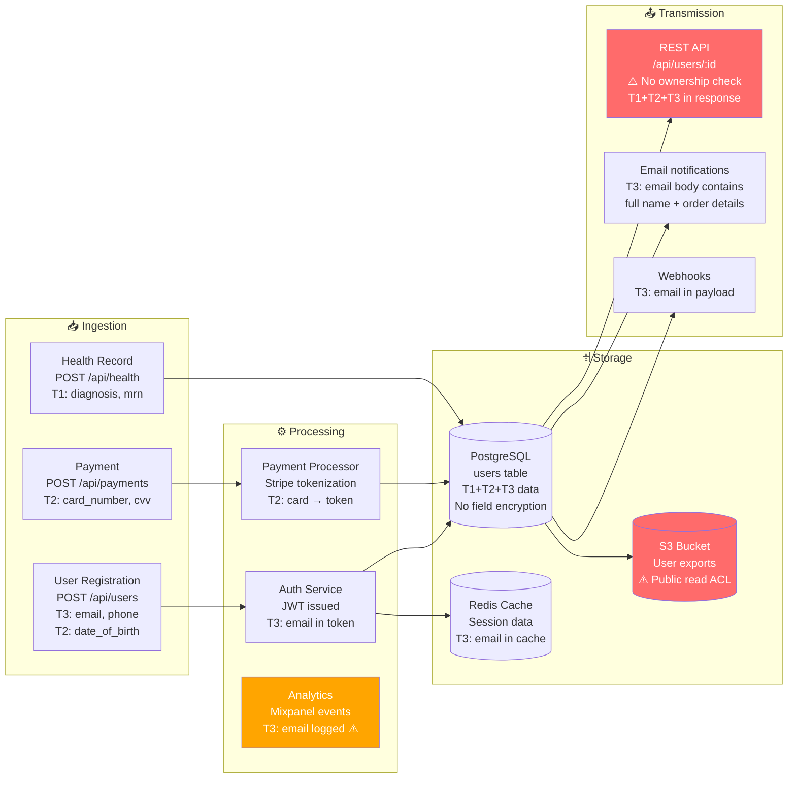

# Blast Radius Report Format

Use this template to generate the complete Data Breach Blast Radius report. Fill every section — do not skip any.

---

## Full Report Template

````markdown
# 💥 Data Breach Blast Radius Report

**Repository:** [repo name or path analyzed]  
**Analysis date:** [ISO 8601 date]  
**Scope:** [full repo / specific path]  
**Languages / frameworks detected:** [list]  
**Analyzed by:** GitHub Copilot — data-breach-blast-radius skill  

---

## Executive Summary

[2–3 paragraphs in plain English. No technical jargon. Assume the reader is a CEO, CISO, or board member who will ask: "How bad would it be?"

Paragraph 1: What data does this system hold and roughly how many people are affected?
Paragraph 2: What is the single most dangerous exposure vector found? What would happen if it were exploited today?
Paragraph 3: What is the estimated financial and regulatory impact? What is the most important thing to fix first?]

---

## Sensitive Data Inventory

All personal, health, financial, and credential data found in the codebase:

| # | Field Name | Source Location | Data Tier | Category | Encrypted? | Logged? | External Exposure? |
|---|-----------|----------------|-----------|----------|-----------|---------|-------------------|
| 1 | `email` | `models/user.py:14` | T3 — High | Contact | ❌ No | ⚠️ Yes | ✅ API response |
| 2 | `ssn` | `models/employee.py:28` | T1 — Catastrophic | Gov. ID | ❌ No | ❌ No | ❌ No |
| 3 | `card_number` | `models/payment.py:9` | T2 — Critical | PCI-DSS | ⚠️ Partial | ❌ No | ❌ No |
| ... | ... | ... | ... | ... | ... | ... | ... |

**Summary:**
- Tier 1 (Catastrophic) fields: [N]
- Tier 2 (Critical) fields: [N]
- Tier 3 (High) fields: [N]
- Tier 4 (Elevated) fields: [N]

---

## Data Flow Map

How sensitive data moves through the system. Read left to right: ingestion → processing → storage → transmission.



---

## Top Exposure Vectors

Ranked by Blast Radius Score (highest first):

### 🔴 Vector 1: [Title] — BRS: [score]/100

**Location:** `[file path]:[line number]`  
**Type:** [IDOR / Unauthenticated endpoint / Public storage / Log leakage / Over-fetching API / etc.]  
**Data exposed:** [T1/T2/T3 fields that would be exposed]  
**Exploitation:** [1–2 sentences — how an attacker would use this]  
**Records at risk:** [number or estimate]  
**Jurisdictions triggered:** [GDPR / CCPA / HIPAA / etc.]

```[language]
// Vulnerable code snippet (exact location)
[code]
```

**Blast Radius Score breakdown:**
- Data tier: T[N] → weight [W]
- Exposure likelihood: [E] ([label])
- Population at risk: [N] records → scale [P]
- Completeness: [factor] ([label])
- Context multiplier: ×[M] ([reason])
- **BRS: [calculated score]/100**

---

### 🔴 Vector 2: [Title] — BRS: [score]/100

[repeat structure]

---

### 🟠 Vector 3: [Title] — BRS: [score]/100

[repeat structure]

---

### 🟠 Vector 4: [Title] — BRS: [score]/100

[repeat structure]

---

### 🟡 Vector 5: [Title] — BRS: [score]/100

[repeat structure]

---

## Regulatory Blast Radius

### Jurisdictions Triggered

| Regulation | Triggered? | Trigger Evidence | Notification Deadline |
|-----------|-----------|-----------------|----------------------|
| GDPR | [Yes/No/Unknown] | [e.g., EUR currency, EU cloud region] | 72 hours |
| CCPA | [Yes/No/Unknown] | [e.g., California users, US domain] | Expedient |
| HIPAA | [Yes/No/Unknown] | [e.g., PHI fields found, FHIR endpoints] | 60 days |
| LGPD | [Yes/No/Unknown] | [e.g., BRL currency, CPF field] | 2 business days |
| Singapore PDPA | [Yes/No/Unknown] | [e.g., SGD, +65 phone patterns] | 3 calendar days |
| PCI-DSS | [Yes/No/Unknown] | [e.g., card_number field found] | Immediate |

---

## Financial Impact Estimate

> These are risk planning estimates only. Consult legal counsel for actual regulatory exposure.

### Maximum Simultaneous Exposure
- **Total records at risk (worst case):** [number]
- **Tier 1 records (catastrophic data):** [number]
- **Estimated affected individuals:** [number]
- **Active regulatory jurisdictions:** [list]

### Financial Impact Range

| Scenario | Estimated Cost | Key Assumptions |
|---------|---------------|----------------|
| **Minimum** (fast response, few records, cooperative regulatory outcome) | $[X] | [assumptions] |
| **Probable** (industry average response time, moderate regulatory action) | $[X] | [assumptions] |
| **Maximum** (slow detection, maximum fines, class action) | $[X] | [assumptions] |

### Breakdown (Probable Scenario)

| Cost Category | Estimate |
|--------------|---------|
| Detection & containment | $[X] |
| Post-breach response | $[X] |
| Legal & forensics | $[X] |
| Breach notification & monitoring | $[X] |
| Regulatory fines ([jurisdictions]) | $[X] |
| Reputational/business impact | $[X] |
| **Total estimated cost** | **$[X]** |

**Cost benchmarks used:** IBM Cost of a Data Breach Report 2024 ($4.88M global average, $165/record average) — verify current figures at ibm.com/reports/data-breach

---

## Hardening Roadmap

Prioritized by `(Blast_Radius_Reduction × Severity) / Effort`:

### 🔴 P0 — Fix Immediately (< 1 day each)

| # | Action | File / Location | Blast Radius Reduction | Effort | Severity |
|---|--------|----------------|----------------------|--------|---------|
| 1 | [Fix IDOR on /api/users/:id — add ownership check] | `routes/users.ts:45` | 85% for this vector | ⚡ Low | CRITICAL |
| 2 | [Remove SSN from API response DTO] | `dtos/employee.dto.ts:22` | 90% for SSN exposure | ⚡ Low | CRITICAL |
| 3 | [Block public read ACL on S3 bucket] | `infra/storage.tf:14` | 100% for S3 exposure | ⚡ Low | HIGH |

---

### 🟠 P1 — Fix This Week

| # | Action | File / Location | Blast Radius Reduction | Effort | Severity |
|---|--------|----------------|----------------------|--------|---------|
| 4 | [Encrypt SSN field with KMS] | `models/employee.py:28` | 80% for SSN field | 🔧 Medium | HIGH |
| 5 | [Remove email from log statements (7 locations)] | `services/auth.py:66,89,121...` | 60% for log vector | 🔧 Medium | HIGH |
| 6 | [Tokenize card data — migrate to Stripe Elements] | `services/payment.py` | 95% for card data | 🔧 Medium | CRITICAL |

---

### 🟡 P2 — Fix This Sprint

| # | Action | Blast Radius Reduction | Effort | Severity |
|---|--------|----------------------|--------|---------|
| 7 | [Add rate limiting to /api/users/search] | 50% for bulk harvest | ⚡ Low | MEDIUM |
| 8 | [Add data access audit log for T1/T2 reads] | -60% detection time | 🔧 Medium | HIGH |
| 9 | [Add field projection to user query (remove unused fields from SELECT)] | 40% reduction in over-fetching | ⚡ Low | MEDIUM |

---

### ⚪ P3 — Fix This Quarter

| # | Action | Blast Radius Reduction | Effort | Severity |
|---|--------|----------------------|--------|---------|
| 10 | [Implement data retention policy + auto-deletion job] | 30% reduction in stale data | 🏗️ High | MEDIUM |
| 11 | [Pseudonymize analytics user IDs] | 70% for analytics data | 🔧 Medium | MEDIUM |
| 12 | [Separate analytics store from production PII DB] | 60% architectural reduction | 🏗️ High | LOW |

---

## Analysis Assumptions

Document all assumptions made during this analysis (transparency is critical):

| Assumption | Value Used | Basis |
|-----------|-----------|-------|
| User population estimate | [X users] | [signal found or conservative default] |
| Annual revenue estimate for fine calculation | [unknown / $X range] | [signals or not found] |
| Geographic distribution | [assumed global / EU users likely] | [currency signals found] |
| Healthcare context | [assumed / not applicable] | [PHI fields found / not found] |

---

## What Was Scanned

- **Files analyzed:** [list key files or note "all files in repo"]
- **Data model files:** [list schema/model files]
- **API layer:** [list controller/route files]
- **Config/infrastructure:** [list .env, terraform, CI/CD files]
- **Log/monitoring:** [list logging config files]
- **Test data:** [note if test fixtures contain real PII]

---

*This report was generated by the [data-breach-blast-radius](https://github.com/github/awesome-copilot/tree/main/skills/data-breach-blast-radius) skill for GitHub Copilot.*  
*For risk planning purposes only. Consult qualified legal counsel and security professionals for actual regulatory guidance.*
````

---

## Mermaid Diagram Conventions

Use these conventions in the Data Flow Map:

```
# Node colors (using style declarations):
🔴 fill:#ff6b6b,color:#fff  → Public/unauthenticated exposure (CRITICAL)
🟠 fill:#ffa500,color:#fff  → Auth required but weak controls (HIGH)
🟡 fill:#ffd700,color:#000  → Internal but over-broad access (MEDIUM)
🟢 fill:#51cf66,color:#fff  → Properly secured (GOOD)

# Node labels should include:
- Action name
- HTTP method + path (for API nodes)
- Data tiers present (T1, T2, T3)
- ⚠️ Warning emoji if an issue exists

# Subgraphs:
- Ingestion (📥)
- Processing (⚙️)
- Storage (🗄️)
- Transmission (📤)
```

---

## Severity Icons

| Symbol | Severity | BRS Range |
|--------|---------|-----------|
| 🔴 | CRITICAL | 76–100 |
| 🟠 | HIGH | 51–75 |
| 🟡 | MEDIUM | 26–50 |
| 🔵 | LOW | 0–25 |
| ✅ | SECURE | Control in place |
| ⚠️ | WARNING | Partial control |
| ❌ | VULNERABLE | No control |
