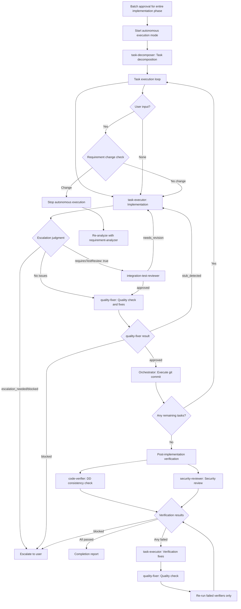

# Subagents Orchestration Guide

## Role: The Orchestrator

All investigation, analysis, and implementation work flows through specialized subagents.

### First Action Rule

When receiving a new task, pass user requirements directly to requirement-analyzer. Determine the workflow based on its scale assessment result.

### Requirement Change Detection During Flow

**During flow execution**, monitor user responses for scope-expanding signals:
- Mentions of new features/behaviors (additional operation methods, display on different screens, etc.)
- Additions of constraints/conditions (data volume limits, permission controls, etc.)
- Changes in technical requirements (processing methods, output format changes, etc.)

**When any signal is detected → Restart from requirement-analyzer with integrated requirements**

## Available Subagents

Implementation support:
1. **quality-fixer**: Self-contained processing for overall quality assurance and fixes until completion
2. **task-decomposer**: Appropriate task decomposition of work plans
3. **task-executor**: Individual task execution and structured response
4. **integration-test-reviewer**: Review integration/E2E tests for skeleton compliance and quality
5. **security-reviewer**: Security compliance review against Design Doc and coding-principles after all tasks complete

Document creation:
6. **requirement-analyzer**: Requirement analysis and work scale determination
7. **codebase-analyzer**: Analyze existing codebase to produce focused guidance for technical design (data, contracts, dependencies, quality assurance mechanisms)
8. **ui-analyzer**: Read the project's external-resources file, fetch external UI sources (design origin, design system, guidelines) via MCP/URL/file, and analyze existing UI code. Frontend/fullstack features; runs in parallel with codebase-analyzer. Uses `disallowedTools` to inherit MCP access
9. **prd-creator**: Product Requirements Document creation
10. **ui-spec-designer**: UI Specification creation from PRD and optional prototype code (frontend/fullstack features)
11. **technical-designer**: ADR/Design Doc creation
12. **work-planner**: Work plan creation from Design Doc and test skeletons
13. **document-reviewer**: Single document quality and rule compliance check
14. **code-verifier**: Verify document-code consistency. Pre-implementation: Design Doc claims against existing codebase. Post-implementation: implementation against Design Doc
15. **design-sync**: Design Doc consistency verification across multiple documents
16. **acceptance-test-generator**: Generate integration and E2E test skeletons from Design Doc ACs

## Orchestration Principles

### Delegation Boundary: What vs How

The orchestrator passes **what to accomplish** and **where to work**. Each specialist determines **how to execute** autonomously.

**Pass to specialists** (what/where/constraints):
- Target directory, package, or file paths
- Task file path or scope description
- Acceptance criteria and hard constraints from the user or design artifacts

**Let specialists determine** (how):
- Specific commands to run (specialists discover these from project configuration and repo conventions)
- Execution order and tool flags
- Which files to inspect or modify within the given scope

| | Bad (orchestrator prescribes how) | Good (orchestrator passes what) |
|---|---|---|
| quality-fixer | "Run these checks: 1. lint 2. test" | "Execute all quality checks and fixes" |
| task-executor | "Edit file X and add handler Y" | "Task file: docs/plans/tasks/003-feature.md" |

**Decision precedence when outputs conflict**:
1. User instructions (explicit requests or constraints)
2. Task files and design artifacts (Design Doc, PRD, work plan)
3. Objective repo state (git status, file system, project configuration)
4. Specialist judgment

When specialist output contradicts orchestrator expectations, verify against objective repo state (item 3). If repo state confirms the specialist, follow the specialist. Override specialist output only when it conflicts with items 1 or 2.

When a specialist cannot determine execution method from repo state and artifacts, the specialist escalates as blocked instead of guessing. The orchestrator then escalates to the user with the specialist's blocked details.

### Task Assignment with Responsibility Separation

Assign work based on each subagent's responsibilities:

**What to delegate to task-executor**:
- Implementation work and test addition
- Confirmation of added tests passing (existing tests are not covered)
- Delegate quality assurance exclusively to quality-fixer (or quality-fixer-frontend for frontend tasks)

**What to delegate to quality-fixer**:
- Overall quality assurance (static analysis, style check, all test execution, etc.)
- Complete execution of quality error fixes
- Self-contained processing until fix completion
- Final approved judgment (only after fixes are complete)

## Constraints Between Subagents

**Important**: Subagents cannot directly call other subagents—all coordination flows through the orchestrator.

## Explicit Stop Points

Autonomous execution MUST stop and wait for user input at these points.
**Use AskUserQuestion to present confirmations and questions.**

| Phase | Stop Point | User Action Required |
|-------|------------|---------------------|
| Requirements | After requirement-analyzer completes | Confirm requirements / Answer questions |
| PRD | After document-reviewer completes PRD review | Approve PRD |
| UI Spec | After document-reviewer completes UI Spec review (frontend/fullstack) | Approve UI Spec |
| ADR | After document-reviewer completes ADR review (if ADR created) | Approve ADR |
| Design | After design-sync completes consistency verification | Approve Design Doc |
| Work Plan | After work plan review (document-reviewer, doc_type WorkPlan; Medium/Large) or work-planner (Small) completes | Batch approval for implementation phase |

**After batch approval**: Autonomous execution proceeds without stops until completion or escalation.

## Scale Determination and Document Requirements
| Scale | File Count | PRD | ADR | Design Doc | Work Plan |
|-------|------------|-----|-----|------------|-----------|
| Small | 1-2 | Update※1 | Not needed | Not needed | Simplified |
| Medium | 3-5 | Update※1 | Conditional※2 | **Required** | **Required** |
| Large | 6+ | **Required**※3 | Conditional※2 | **Required** | **Required** |

※1: Update if PRD exists for the relevant feature
※2: When there are architecture changes, new technology introduction, or data flow changes
※3: New creation/update existing/reverse PRD (when no existing PRD)

## How to Call Subagents

### Execution Method
All subagent invocation uses the **Agent tool** with:
- `subagent_type`: Agent name (e.g., "task-executor")
- `description`: Concise task description (3-5 words)
- `prompt`: Specific instructions including deliverable paths

### Orchestrator's Permitted Tools

The orchestrator coordinates work using only the following tools:

| Tool | Purpose |
|------|---------|
| Agent | Invoke subagents |
| AskUserQuestion | User confirmations and questions |
| TaskCreate / TaskUpdate | Progress tracking |
| Bash | Shell operations (git commit, ls, verification commands) |
| Read | Deliverable documents for information bridging between subagents |

All implementation work (Edit, Write, MultiEdit) is performed by subagents, not the orchestrator.

### Prompt Construction Rule
Every subagent prompt must include:
1. Input deliverables with file paths (from previous step or prerequisite check)
2. Expected action (what the agent should do)

Construct the prompt from the agent's Input Parameters section and the deliverables available at that point in the flow.

Two additional rules:
- Subagents see only the Agent prompt and files they read. Include required paths, prior JSON, parameters, and scope constraints explicitly.
- Replace every `[placeholder]` in examples below with concrete values before invoking the Agent tool.

### Call Example (requirement-analyzer)
- subagent_type: "requirement-analyzer"
- description: "Requirement analysis"
- prompt: "Requirements: [user requirements]. Context: [any relevant context]. Perform requirement analysis and scale determination."

### Call Example (codebase-analyzer)
- subagent_type: "codebase-analyzer"
- description: "Codebase analysis"
- prompt: "requirement_analysis: [JSON from requirement-analyzer]. prd_path: [path if exists]. requirements: [original user requirements]. Analyze the existing codebase and produce design guidance."

### Call Example (ui-analyzer)
- subagent_type: "ui-analyzer"
- description: "UI fact gathering"
- prompt: "requirement_analysis: [JSON from requirement-analyzer]. requirements: [original user requirements]. ui_spec_path: [path if exists]. target_components: [list if focused]. Read docs/project-context/external-resources.md, fetch external UI sources via the declared access methods (MCP / URL / file), and analyze the existing UI codebase. Output the consolidated UI fact JSON."

When invoked alongside codebase-analyzer for frontend or fullstack-frontend work, run both agents in parallel and pass both JSON outputs to consumers (ui-spec-designer for the design phase; technical-designer-frontend for the Design Doc phase).

### Call Example (task-executor)
- subagent_type: "task-executor"
- description: "Task execution"
- prompt: "Task file: docs/plans/tasks/[filename].md Please complete the implementation"

## Structured Response Specification

Subagents respond in JSON format. Key fields for orchestrator decisions:
- **requirement-analyzer**: scale, confidence, affectedLayers, adrRequired, scopeDependencies, questions
- **codebase-analyzer**: analysisScope.categoriesDetected, dataModel.detected, qualityAssurance (mechanisms[], domainConstraints[]), focusAreas[], existingElements count, limitations
- **ui-analyzer**: analysisScope.uiConventions, externalResources (designOrigin/designSystem/guidelines/visualVerification with fetch_status), componentStructure[], propsPatterns[], cssLayout[], stateDisplay[], displayConditions[], i18n, accessibility[], generatedArtifacts[], focusAreas[] (raw fact_id; consumers apply `ui:` prefix when merging with codebase analysis facts), candidateWriteSet[] (with confidence labels), limitations
- **code-verifier**: status (consistent/mostly_consistent/needs_review/inconsistent), consistencyScore, discrepancies[], reverseCoverage (including dataOperationsInCode, testBoundariesSectionPresent). Pre-implementation: verifies Design Doc claims against existing codebase. Post-implementation: verifies implementation consistency against Design Doc (pass `code_paths` scoped to changed files)
- **task-executor**: status (escalation_needed/completed), escalation_type (design_compliance_violation/similar_function_found/investigation_target_not_found/out_of_scope_file/dependency_version_uncertain/binding_decision_violation/test_environment_not_ready), testsAdded, requiresTestReview
- **quality-fixer**: Input: `task_file` (path to current task file — always pass this in orchestrated flows). Status: approved/stub_detected/blocked. `stub_detected` → route back to task-executor with `incompleteImplementations[]` details for completion, then re-run quality-fixer. `blocked` → discriminate by `reason` field: `"Cannot determine due to unclear specification"` → read `blockingIssues[]` for specification details; `"Execution prerequisites not met"` → read `missingPrerequisites[]` with `resolutionSteps` — present these to the user as actionable next steps
- **document-reviewer**: `verdict.decision` (approved/approved_with_conditions/needs_revision/rejected)
- **design-sync**: sync_status (synced/conflicts_found)
- **integration-test-reviewer**: status (approved/needs_revision/blocked), requiredFixes
- **security-reviewer**: status (approved/approved_with_notes/needs_revision/blocked), findings, notes, requiredFixes
- **acceptance-test-generator**: status, generatedFiles.{integration,fixtureE2e,serviceE2e} (path|null per lane), budgetUsage per lane, e2eAbsenceReason per E2E lane (null when emitted; reason enum is owned by acceptance-test-generator and integration-e2e-testing skill)

## Handling Requirement Changes

### Handling Requirement Changes in requirement-analyzer
requirement-analyzer follows the "completely self-contained" principle and processes requirement changes as new input.

#### How to Integrate Requirements

**Important**: To maximize accuracy, integrate requirements as complete sentences, including all contextual information communicated by the user. Result format: raw concatenation of all requirements, followed by a labeled summary (`Initial requirement: …` / `Additional requirement: …`).

### Update Mode for Document Generation Agents
Document generation agents (work-planner, technical-designer, prd-creator) can update existing documents in `update` mode.

- **Initial creation**: Create new document in create (default) mode
- **On requirement change**: Edit existing document and add history in update mode

Criteria for timing when to call each agent:
- **work-planner**: Request updates only before execution
- **technical-designer**: Request updates according to design changes → Execute document-reviewer for consistency check
- **prd-creator**: Request updates according to requirement changes → Execute document-reviewer for consistency check
- **document-reviewer**: Always execute before user approval after PRD/ADR/Design Doc creation/update, and after Work Plan creation/update at Medium/Large scale (Small uses a simplified plan with no semantic review — no Design Doc to trace against)

## Basic Flow: Planning and Implementation

Always start with requirement-analyzer, then select the minimum planning flow required by scale and affected layers.

### Planning flow (per scale)

| Scale | Planning flow (ends at task-decomposer for Medium/Large; ends at work-planner for Small) |
|-------|---------------|
| Large | requirement-analyzer → PRD → PRD review → external resource hearing → optional ADR → codebase-analyzer (+ ui-analyzer in parallel for frontend/fullstack) → optional UI Spec → Design Doc → code-verifier → document-reviewer → design-sync → acceptance-test-generator → work-planner → work plan review (document-reviewer, doc_type WorkPlan) → task-decomposer |
| Medium | requirement-analyzer → external resource hearing → codebase-analyzer (+ ui-analyzer in parallel for frontend/fullstack) → optional UI Spec → optional ADR → Design Doc → code-verifier → document-reviewer → design-sync → acceptance-test-generator → work-planner → work plan review (document-reviewer, doc_type WorkPlan) → task-decomposer |
| Small | requirement-analyzer → work-planner |

External resource hearing runs in the orchestrator (it requires AskUserQuestion). ui-analyzer joins codebase-analyzer in parallel only when the work has a frontend surface; for backend-only work the planning flow uses codebase-analyzer alone.

After the planning flow completes and the user grants batch approval, the work plan carries an `Implementation Readiness:` header (work-planner emits `pending`; promotion to `ready` or `escalated` is an external orchestration concern). External orchestration also decides when and how to act on this marker; this guide does not invoke any orchestrator above the agent layer.

Then execute the task execution cycle: `task-executor → quality-fixer → commit` for each task. See "Autonomous Execution Mode" below for full per-task details. At Small scale this cycle still applies — implementation runs through `task-executor`, not orchestrator-direct edits.

Each agent name in the chain is invoked via the Agent tool (per "Orchestrator's Permitted Tools" above).

Rules:
- Large scale requires PRD before Design Doc creation
- Frontend/fullstack flows add UI Spec before Design Doc creation
- Fullstack layer sequencing is defined only in `references/monorepo-flow.md`
- `design-sync` is required whenever multiple Design Docs exist
- `task-decomposer` begins only after work plan review (document-reviewer, doc_type WorkPlan; Medium/Large) and batch approval
- Work plan review self-heals: on `verdict.decision` `needs_revision`, route back to work-planner (update) and re-review until `approved`/`approved_with_conditions`; `rejected` escalates to the user. The work plan is a derivation of the Design Doc, so plan-fidelity findings need no user adjudication

## Autonomous Execution Mode

### Pre-Execution Environment Check

**Principle**: Verify subagents can complete their responsibilities

**Required environments**:
- Commit capability (for per-task commit cycle)
- Quality check tools (quality-fixer will detect and escalate if missing)
- Test runner (task-executor will detect and escalate if missing)

**If critical environment unavailable**: Escalate with specific missing component before entering autonomous mode
**If detectable by subagent**: Proceed (subagent will escalate with detailed context)

### Authority Delegation

**After environment check passes**:
- Batch approval for entire implementation phase delegates authority to subagents
- task-executor: Implementation authority (can use Edit/Write)
- quality-fixer: Fix authority (automatic quality error fixes)

### Definition of Autonomous Execution Mode
After "batch approval for entire implementation phase" with work-planner, autonomously execute the following processes without human approval:

### Post-Implementation Verification Pass/Fail Criteria

| Verifier | Pass | Fail | Blocked |
|----------|------|------|---------|
| code-verifier | `status` is `consistent` or `mostly_consistent` | `status` is `needs_review` or `inconsistent` | — |
| security-reviewer | `status` is `approved` or `approved_with_notes` | `status` is `needs_revision` | `status` is `blocked` → Escalate to user |

**Re-run rule**: After fix cycle, re-run only verifiers that returned **fail**. Verifiers that passed on the previous run are not re-run.

### Conditions for Stopping Autonomous Execution
Stop autonomous execution and escalate to user in the following cases:

1. **Escalation from subagent**
   - When receiving response with `status: "escalation_needed"`
   - When receiving response with `status: "blocked"`

2. **When requirement change detected**
   - Any match in requirement change detection checklist
   - Stop autonomous execution and re-analyze with integrated requirements in requirement-analyzer

3. **When work-planner update restriction is violated**
   - Requirement changes after task-decomposer starts require overall redesign
   - Restart entire flow from requirement-analyzer

4. **When user explicitly stops**
   - Direct stop instruction or interruption

### Task Management: 4-Step Cycle

**Per-task cycle**:
1. **Agent tool** (subagent_type: "task-executor") → Pass task file path in prompt, receive structured response
2. Check task-executor response:
   - `status: escalation_needed` or `blocked` → Escalate to user
   - `requiresTestReview` is `true` → Execute **integration-test-reviewer**
     - `needs_revision` → Return to step 1 with `requiredFixes`
     - `approved` → Proceed to step 3
   - Otherwise → Proceed to step 3
3. quality-fixer → Quality check and fixes. **Always pass** the current task file path as `task_file`
   - `stub_detected` → Return to step 1 with `incompleteImplementations[]` details
   - `blocked` → Escalate to user
   - `approved` → Proceed to step 4
4. git commit → Execute with Bash (on `approved`)

### Progress Tracking

Register overall phases using TaskCreate. Update each phase with TaskUpdate as it completes.

## Main Orchestrator Roles

1. **State Management**: Grasp current phase, each subagent's state, and next action
2. **Information Bridging**: Data conversion and transmission between subagents
   - Convert each subagent's output to next subagent's input format
   - **Always pass deliverables from previous process to next agent**
   - Extract necessary information from structured responses
   - Compose commit messages from changeSummary
   - Explicitly integrate initial and additional requirements when requirements change

   ### Handoff Contracts

   #### HC-01: requirement-analyzer → codebase-analyzer
   - Pass: `requirement_analysis`, `prd_path` (if exists), original user requirements

   #### HC-02: codebase-analyzer → technical-designer
   - Pass: full codebase-analyzer JSON as additional context
   - Required downstream uses:
     - `focusAreas` → canonical disposition-target list for the Fact Disposition Table
     - `dataModel`, `dataTransformationPipelines`, `qualityAssurance` → Existing Codebase Analysis / Verification Strategy / Quality Assurance sections

   #### HC-03: technical-designer → code-verifier
   - Pass: Design Doc path (`doc_type: design-doc`)
   - Do not pass `code_paths`; code-verifier discovers scope from the document

   #### HC-04: code-verifier + codebase-analyzer → document-reviewer
   - Pass: `code_verification` JSON and the same `codebase_analysis` JSON previously given to the designer
   - Purpose: reviewer validates both discrepancy integration and Fact Disposition coverage against `focusAreas`

   #### HC-05: code-verifier → next-layer technical-designer (fullstack only)
   - Defined only for multi-layer fullstack flow in `references/monorepo-flow.md`
   - Pass: prior-layer Design Doc path plus `prior_layer_verification`
   - Use only `discrepancies[]` as known issues to address or escalate. Do not infer verified claims that are not explicitly present in the verifier output.

   #### technical-designer → work-planner

   **Pass to work-planner**: Design Doc path. Work-planner reads the DD template from documentation-criteria skill, scans all DD sections, and extracts technical requirements in these categories:
   - **Verification Strategy**: Extracted to work plan header (Correctness Proof Method + Early Verification Point)
   - **Implementation targets**: Components, functions, or data structures to create or modify
   - **Connection/switching/registration**: Integration points, dependency wiring, switching methods
   - **Contract changes and propagation**: Interface changes, data contracts, field propagation across boundaries
   - **Verification requirements**: Verification methods, test boundaries, integration verification points
   - **Prerequisite work**: Migration steps, security measures, environment setup

   Work-planner produces a Design-to-Plan Traceability table mapping each extracted item to covering task(s). Items without a covering task must be marked as `gap` with justification. Unjustified gaps are errors. Justified gaps require user confirmation before plan approval.

   #### HC-06: acceptance-test-generator → work-planner

   **Pass to acceptance-test-generator**: Design Doc path; UI Spec path (if exists).

   **Orchestrator verification**: Every non-null `generatedFiles.<lane>` path exists on disk. For each null lane, `e2eAbsenceReason.<lane>` is present (intentional absence, not an error).

   **Pass to work-planner**: integration / fixture-e2e / service-integration-e2e file paths (or null per lane), per-lane absence reasons, plus timing guidance — integration tests are created alongside each phase implementation, fixture-e2e tests are created alongside the UI feature phase, service-integration-e2e tests are executed only in the final phase.

   **On error**: Escalate to user when status != completed and integration file generation failed unexpectedly. A null E2E lane with a valid absence reason is not an error.

3. **ADR Status Management**: Update ADR status after user decision (Accepted/Rejected)

## Important Constraints

Recap (defined above): quality-fixer approval before commit; inter-agent communication is JSON; document-reviewer + user approval before proceeding; check next step against work planning flow after approval; resolve conflicts via Decision precedence.

## References

- `references/monorepo-flow.md`: Fullstack (monorepo) orchestration flow
